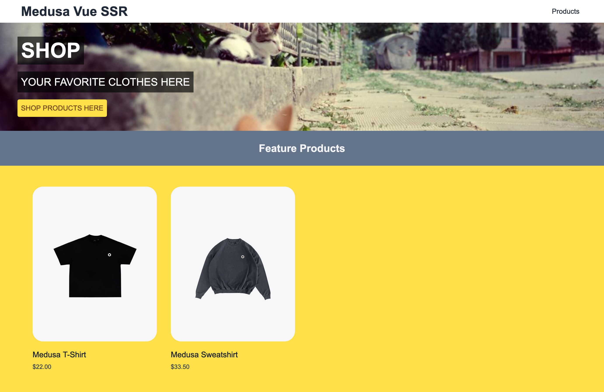
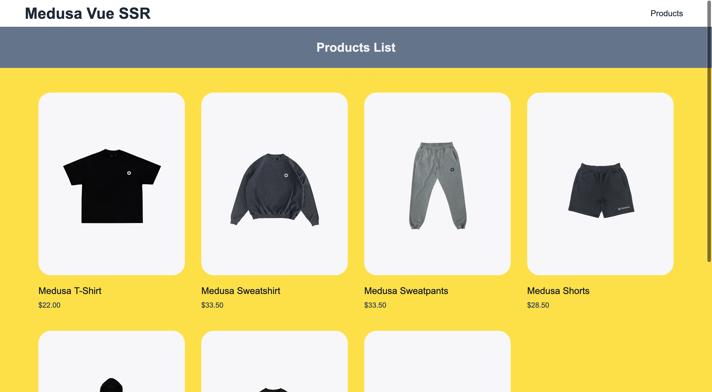
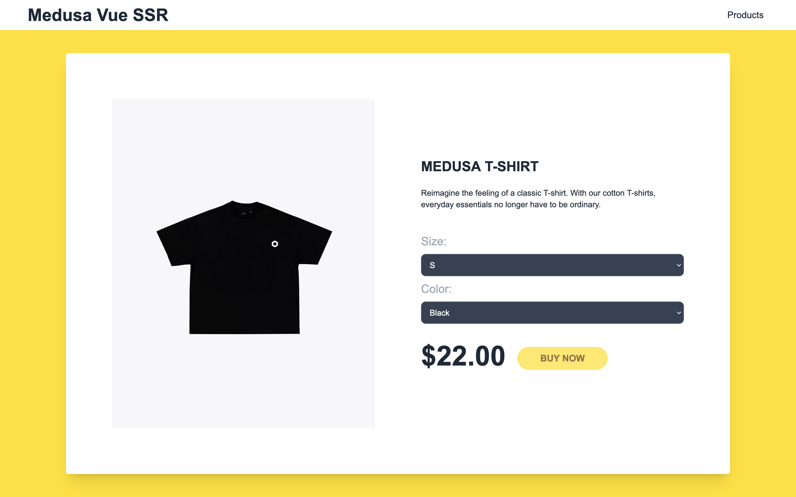

## Medusa Vue SSR


## About

### Participants
Vincent - [@vinmaster](https://github.com/vinmaster)

### Description

An open source ecommerce mobile application built using Medusa and [vite-plugin-ssr](https://vite-plugin-ssr.com/)

### Preview





## Set up Project

### Prerequisites
Before you start with the tutorial make sure you have

- [Node.js](https://nodejs.org/en/) v14 or greater installed on your machine
- [Medusa server](https://docs.medusajs.com/quickstart/quick-start/) v14 or greater installed on your machine

### Install Project

1. Clone the repository:

```bash
git clone https://github.com/vinmaster/medusa-vue-ssr
```

2. Change directory and install dependencies:

```bash
cd backend
npm install
```

```bash
cd client
npm install
```
4.  Start the app
```bash
cd backend
npm start
```

```bash
cd client
npm run dev
```

## Resources
- [Medusa’s GitHub repository](https://github.com/medusajs/medusa)
- [Medusa Admin Panel](https://github.com/medusajs/admin)
- [Medusa Documentation](https://docs.medusajs.com/)
